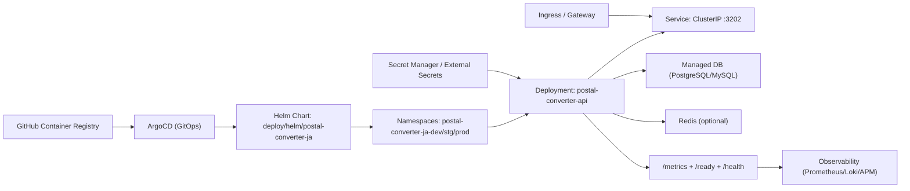

# K8S Adoption Blueprint (v0.8.3)

既存の Kubernetes 運用基盤に `postal_converter_ja` を安全に組み込むための設計図です。

## 1. 設計図（全体像）



## 2. 責務分離（運用しやすい構成）

- アプリ責務:
  - API Pod の稼働、`/health` と `/ready` 提供、`/metrics` 出力
- プラットフォーム責務:
  - Ingress/Gateway、証明書、WAF、ネットワークポリシー
  - Secret 配布（External Secrets / Sealed Secrets）
  - 監視・アラート基盤（Prometheus/Grafana/Loki など）

## 3. ネットワーク設計

- Ingress/Gateway -> `postal-converter-ja` Namespace 内 Service (`ClusterIP`)
- 外部公開は Ingress でのみ実施（Service を `LoadBalancer` にしない）
- 推奨:
  - Namespace 単位で NetworkPolicy を適用
  - Egress を DB/Redis 先に限定

## 4. Secret 設計

`values.yaml` の Secret 値はサンプルです。実運用では以下に置換:

- `POSTGRES_DATABASE_URL`
- `MYSQL_DATABASE_URL`
- `REDIS_URL`
- 必要時 `SQLITE_DATABASE_PATH`

推奨ルート:

- External Secrets Operator + AWS Secrets Manager / GCP Secret Manager
- もしくは SOPS + Git 管理

## 5. 監視設計

- Liveness: `/health`
- Readiness: `/ready`
- Metrics: `/metrics` (JSON)

最小監視項目:

- `requests_total`
- `errors_total`
- `not_found_total`
- `average_latency_ms`

アラート例:

- 5xx 比率が 5 分平均で閾値超過
- `ready` 失敗継続
- レイテンシ悪化

## 6. ロールバック設計

Helm ルート:

```bash
helm -n postal-converter-ja history postal-converter-ja
helm -n postal-converter-ja rollback postal-converter-ja <REVISION>
```

ArgoCD ルート:

```bash
argocd app history postal-converter-ja
argocd app rollback postal-converter-ja <ID>
```

共通:

- DBスキーマ変更を伴う場合は、アプリロールバック前に互換性確認
- Secret ローテーション直後の障害は直前バージョンへ戻す

## 7. 導入手順（既存Kubernetes運用へ投入）

### Step 0: 事前確認

```bash
kubectl version --client
kubectl config current-context
helm version
```

### Step 1: values オーバーライドを確認

v0.8.3 では環境別 values をあらかじめ用意:

- `deploy/helm/postal-converter-ja/values-dev.yaml`
- `deploy/helm/postal-converter-ja/values-stg.yaml`
- `deploy/helm/postal-converter-ja/values-prod.yaml`

### Step 2: Secret を既存基盤で作成（例）

```bash
kubectl -n external-secrets get clustersecretstore
kubectl -n postal-converter-ja-dev get externalsecret
kubectl -n postal-converter-ja-stg get externalsecret
kubectl -n postal-converter-ja-prod get externalsecret
```

### Step 3: マニフェスト差分確認（dry-run）

```bash
helm template postal-converter-ja deploy/helm/postal-converter-ja \
  -n postal-converter-ja-prod \
  -f deploy/helm/postal-converter-ja/values.yaml \
  -f deploy/helm/postal-converter-ja/values-prod.yaml > /tmp/postal-rendered.yaml
kubeconform -strict -summary -ignore-missing-schemas /tmp/postal-rendered.yaml
```

補足:

- CRD（例: `ExternalSecret`）は kubeconform のデフォルトスキーマ対象外のため、CI では `-ignore-missing-schemas` を利用します。
- 許容方針と見直し条件は `docs/CI_DESIGN.md` に明文化します。

### Step 4: デプロイ

```bash
helm upgrade --install postal-converter-ja deploy/helm/postal-converter-ja \
  -n postal-converter-ja-prod \
  --create-namespace \
  -f deploy/helm/postal-converter-ja/values.yaml \
  -f deploy/helm/postal-converter-ja/values-prod.yaml
```

### Step 5: 稼働確認

```bash
kubectl -n postal-converter-ja-prod get deploy,po,svc,ingress,networkpolicy,externalsecret
kubectl -n postal-converter-ja-prod rollout status deploy/postal-converter-ja
kubectl -n postal-converter-ja-prod port-forward svc/postal-converter-ja 3202:3202
curl -fsS http://127.0.0.1:3202/health
curl -fsS http://127.0.0.1:3202/ready
```

### Step 6: ArgoCD へ移行する場合

```bash
kubectl apply -f deploy/argocd/application-postal-converter-ja.yaml
argocd app sync postal-converter-ja-dev
argocd app sync postal-converter-ja-stg
argocd app sync postal-converter-ja-prod
argocd app wait postal-converter-ja-dev --health --operation
argocd app wait postal-converter-ja-stg --health --operation
argocd app wait postal-converter-ja-prod --health --operation
```

## 8. v0.8.3 の到達点

- Helm デフォルト導入ルートを用意
- Kustomize 最小雛形を用意
- ArgoCD GitOps ルートを `dev/stg/prod` に分離
- External Secret / Ingress / NetworkPolicy の最小雛形を追加
- CI に Helm template + kubeconform 検証を追加
- 既存運用へ組み込む導入手順を定義
