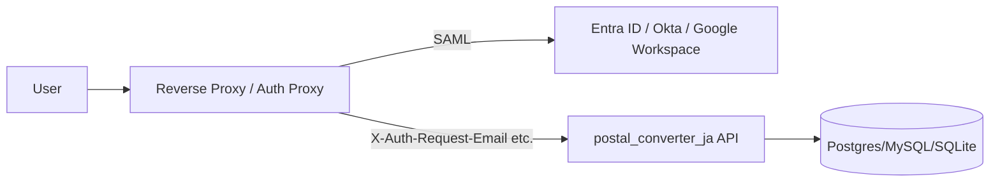

# SAML/SSO 最小構成設計（v0.5.0 Task2）

## 目的

API サービス本体に SAML 実装を直接持ち込まず、
**IdP 連携済みの認証プロキシが付与するヘッダ**を API 側で検証する最小構成を定義する。

- 低コストで導入を開始できる
- API の責務を「ヘッダ検証 + 認可前提の入口制御」に限定できる
- 将来の SSO 拡張（SCIM, RBAC, 監査）に段階移行しやすい

## 最小アーキテクチャ



- SAML 認証はプロキシ側で完了
- API は `AUTH_USER_HEADER` の存在を確認して受け入れ
- 匿名許可パス（ヘルスチェック等）は API 側で例外扱い

## API 側の設定（実装済み最小セット）

```env
AUTH_MODE=sso_header
AUTH_USER_HEADER=x-auth-request-email
AUTH_GROUPS_HEADER=
AUTH_ANONYMOUS_PATHS=/health,/ready,/openapi.json,/docs
```

### 挙動

- `AUTH_MODE=none`: 認証なし
- `AUTH_MODE=sso_header`:
  - 通常 API パスで `AUTH_USER_HEADER` が無い場合 `401`
  - `AUTH_ANONYMOUS_PATHS` に含まれる prefix は認証スキップ

## プロキシ側の最小要件

1. SAML で IdP 認証できること
2. 認証済みリクエストに `AUTH_USER_HEADER` を付与すること
3. クライアントから同名ヘッダを直接注入できないようにすること
4. API 直アクセスを遮断し、必ずプロキシ経由にすること

## セキュリティ境界の前提

- API 単体では SAML アサーションを検証しない
- 信頼境界は「認証プロキシ〜API 間ネットワーク」
- 本番では以下を推奨
  - API を private subnet / internal LB 配下へ配置
  - `IP_ALLOWLIST` でプロキシ送信元を限定
  - mTLS または VPC 内通信で中間者リスクを低減

## v0.5.0 以降の拡張ポイント

- **SAML/SSO + 監査証跡**
  - ユーザ識別子とリクエストIDの監査ログ整備
- **IP制限・VPC接続・秘密情報管理**
  - Secret Manager / KMS で機密値管理
- **SLO/Runbook**
  - SSO 障害時のフェイルセーフと運用手順

## 非目標（このタスクでは実施しない）

- API サービス内での SAML 直接実装
- グループベース認可（RBAC）の厳密適用
- SCIM 連携
